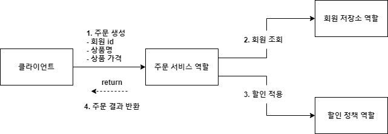
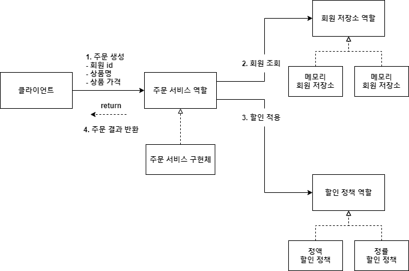
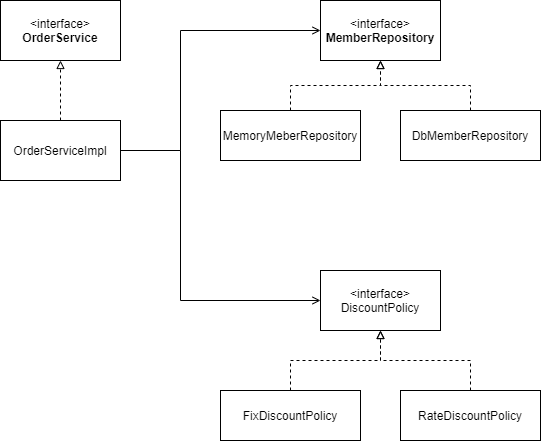
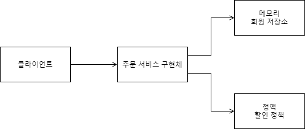
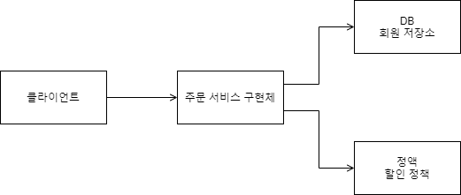

# 주문과 할인 도메인 설계

- 주문과 할인 정책

    - 회원은 상품을 주문할 수 있다.

    - 회원 등급에 따라 할인 정책을 적용할 수 있다.

    - 할인 정책은 모든 VIP는 1000원을 할인해주는 고정 금액 할인을 적용해달라. (나중에 변경 될 수 있다.)

    - 할인 정책은 변경 가능성이 높다. 회사의 기본 할인 정책을 아직 정하지 못했고, 오픈 직전까지 고민을 미루고 싶다. 최악의 경우 할인을 적용하지 않을 수 도 있다. (미확정)

**\* 주문 도메인 협력, 역할, 책임** 

1. 주문 생성: 클라이언트는 주문 서비스에 주문 생성을 요청한다.

2. 회원 조회 : 할인을 위해서는 회원 등급이 필요하다. 그래서 주문 서비스는 회원 저장소에서 회원을 조회한다.

3. 할인 적용 : 주문 서비스는 회원 등급에 따른 할인 여부를 할인 정책에 위임한다.

4. 주문 결과 반환 : 주문 서비스는 할인 결과를 포함한 주문 결과를 반환한다.

**\* 주문 도메인 전체** 

**\* 역할과 구현을분리** 해서 자유롭게 구현 객체를 조립할 수 있게 설계했다.

덕분에 회원 저장소는물론이고, 할인 정책도 유연하게 변경할 수 있다.

**\* 주문 도메인 클래스 다이어그램** 

**\* 주문 도메인 객체 다이어그램1** 

회원을 메모리에서 조회하고, 정액 할인 정책(고정 금액)을 지원해도 주문 서비스를 변경하지 않아도 된다.

-> 역할들의 협력 관계를 그대로 재사용 할 수 있다.

**\* 주문 도메인 객체 다이어그램2** 

회원을 메모리가 아닌 실제 DB에서 조회하고, 정률 할인 정책(주문 금액에 따라 % 할인)을 지원해도 주문 서비스를 변경하지 않아도 된다.

-> 협력 관계를 그대로 재사용 할 수 있다.