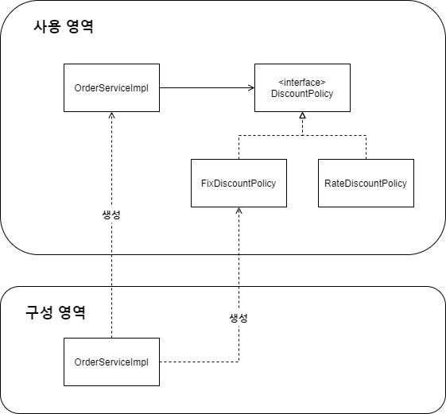
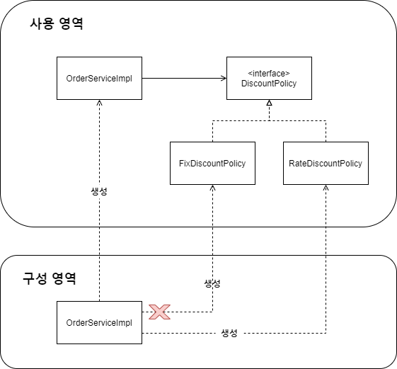

# 새로운 구조와 할인 정책 적용

- 처음으로 돌아가서 정액 할인 정책을 정률% 할인 정책으로 변경해보자.

- FixDiscountPolicy -> RateDiscountPolicy

- 어떤 부분만 변경하면 되겠는가?


\* AppConfig의 등장으로 애플리케이션이 크게 사용 영역과, 객체를 생성하고 구성(Configuration)하는 영역으로 분리되었다.

\* 사용, 구성의 분리




\* 할인 정책의 변경




\* FixDiscountPolicy -> RateDiscountPolicy 로 변경해도 구성 영역만 영향을 받고, 사용 영역은 전혀 영향을 받지 않는다.


**할인 정책 변경 구성 코드**

```java
public class AppConfig {

    public MemberService memberService() {
        return new MemberServiceImpl(memberRepository());
    }

    private MemberRepository memberRepository() {
        return new MemoryMemberRepository();

    }

    public OrderService orderService() {
        return new OrderServiceImpl(memberRepository(), discountPolicy());
    }

    public DiscountPolicy discountPolicy() {
//      return new FixDiscountPolicy();
        return new RateDiscountPolicy();
    }
}
```

- AppConfig에서 할인 정책 역할을 담당하는 구현을 FixDiscountPolicy -> RateDiscountPolicy 객체로 변경 했다.

- 이제 할인 정책을 변경해도, 애플리케이션의 구성 역할을 담당하는 AppConfig만 변경하면 된다. 클라이언트 코드인 OrderServiceImpl을 퐇마해서 **사용 영역**의 어떤 코드도 변경할 필요가 없다.

- **구성 영역**은 당연히 변경된다. 구성 역할을 담당하는 AppConfig를 애플리케이션이라는 공연의 기획자로 생각하자. 공연의 기획자는 공연 참여자인 구현 객체들을 모두 알아야 한다.