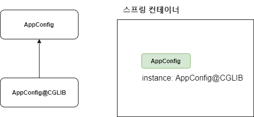

# @Configuration과 바이트코드 조작의 마법

스프링 컨테이너는 싱글톤 레지스트리다. 따라서 스프링 빈이 싱글톤이 되도록 보장을해주어야 한다. 그런데 스프링이 자바 코드까지 어떻게 하기는 어렵다.

저 자바 코드를 보면 분명 3번 호출되는 것이 맞다.

```java
    @Test
    void configurationDeep() {
        AnnotationConfigApplicationContext ac = new AnnotationConfigApplicationContext(AppConfig.class);
        AppConfig bean = ac.getBean(AppConfig.class);

        System.out.println("bean ="+bean.getClass());
    }
```

사실 `AnnotationConfigApplicationContext`에 파라미터로 넘긴 값은 스프링 빈으로 등록된다. 그래서 `AppConfig`도 스프링 빈이 된다.

`AppConfig` 스프링 빈을 조회해서 클래스 정보를 출력해보자.
```
bean =class com.core.AppConfig$$EnhancerBySpringCGLIB$$17c825d0
```

순수 클래스라면 다음과 같이 출력되어야 한다.
class com.core,AppConfig

그런데 예상과는 다르게 클래스 명에 xxxCGLIB가 붙으면서 상당히 복잡해진 것을 볼 수 있다. 이것은 내가 만든 클래스가 아니라 스프링 CGLIB라는 바이트조작 라이브러리를 사용해서 AppConfig 클래스를 상속받은 임의읭 다른 클래스를 만들고, 다른 클래스를 스프링 빈으로 등록한 것이다.



그 임의의 다른 클래스가 바로 싱글톤이 보장되도록 해준다. 아마도 다음과 같이 바이트 코드를 조작해서 작성되어 있을 것이다. 
(실제로는 CGLIB의 내부 기술을 사용하는데 매우 복잡하다.)

\* AppConfig@CGLIB 예상 코드
```java
@Bean
public MemberRepository memberRepository() {
    if(memoryMemberRepository가 이미 스프링 컨테이너에 등록되어 있으면) {
        return 스프링 컨테이너에서 찾아서 반환;
    } else {
        기존 로직을 호출해서 MemoryMemberRepository를 생성하고 스프링 컨테이너에 등록
        return 반환
    }

}
```

- @Bean이 붙은 메서드 마다 이미 스프링 빈이 존재하면 존재하는 빈을 반환하고, 스프링 빈이 없으면 생성해서 스프링 빈으로 등록하고 반환하는 코드가 동적으로 만들어진다.

- 덕분에 싱글톤이 보장되는 것이다.

\* 참고: AppConfig@CGLIB는 AppConfig의 자식 타입으로, AppCOnfig타입으로 조회 할 수 있다.

### @Configuration을 적용하지 않고 @Bean만 적용하면 어떻게 되나요?

@Configuration을 붙이면 바이트코드를 조작하는 CGLIB 기술을 사용해서 싱글톤을 보장하지만, 만약 @Bean만 적용하면 어떻게 될까요?

```java
//@Configuration
public class AppConfig {
    ...
}
```

이출력 결과를 통해서 AppConfig가 CGLIB 기술 없이 순수한 AppConfig로 스프링빈에 등록된 것을 확인 할 수 있다.

이 출력 결과를 통해서 MemberRepository가 총 3번 호출된 것을 알 수 있다.

1번은 @Bean에 의해 스프링 컨테이너에 등록하기 위해서고, 2번은 각각 memberRepository()를 호출하면서 발생한 코드다.

당연히 인스턴스가 같은지 테스트 하는 코드도 실패하고, 각각 다 다른 Memberrepository인스턴스를 가지고 있다.

확인이 끝났으면 @Configuration이 동작하도록 다시 돌려놓자.

### 정리

@Bean만 사용해도 스프링 빈으로 등록되지만, 싱글톤이 보장되지 않는다.

    - memberRepository() 처럼 의존관계 주입이 필요해서 메서드를 직접 호출할 때 싱글톤을 보장하지 않는다.

    - 크게 고민할 것이 없다. 스프링 설정 정보는 항상 @Configuration을 사용하자.

    

