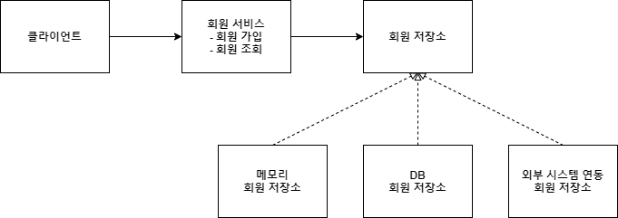
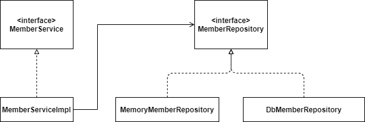

# 회원 도메인 설계

- 회원 도메인 요구사항

    - 회원은 가입하고 조회할 수 있다.

    - 회원은 일반과 VIP 두 가지 등급이 있다.

    - 회원 데이터는 자체 DB를 구축할 수 있고, 외부 시스템과 연동할 수 있다. (미확젇)

\* 그림 은 보통 3가지로 그림.

도메인 협력관계
 
 : 기획자들도 볼 수 있는 그림

클래스 다이어그램
 
 : 구체화

회원 객체 다이어그램
 
 : 객체간의 메모리 참조 -> 서버가 실제 떠서 실제로 사용되는 유효한 인스턴스들의 참조

**\* 회원 도메인 협력 관계**

**\* 회원 클래스 다이어그램**

**\* 회원 객체 다이어그램**

